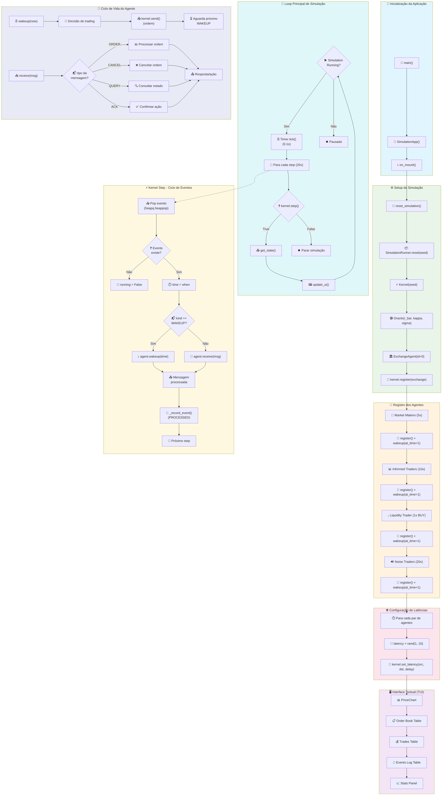

# Fluxograma DEMAS v0.1.1

## Legenda

| Símbolo | Significado |
|---------|-------------|
| 📱 | Ponto de entrada |
| ⚙️ | Configuração |
| 👥 | Registro de agentes |
| 🌐 | Rede/Comunicação |
| 🖥️ | Interface TUI |
| 🔄 | Loop principal |
| ⚡ | Processamento de eventos |
| 🔵 | Comportamento do agente |

## Fluxo Principal

1. **Inicialização**: `main()` → `SimulationApp` → `on_mount()`
2. **Setup**: Criação do Kernel, Oracle, Exchange e todos os agentes
3. **Execução**: Loop de simulação processando eventos através do Kernel
4. **Interface**: Atualização visual a cada tick (0.1s)
